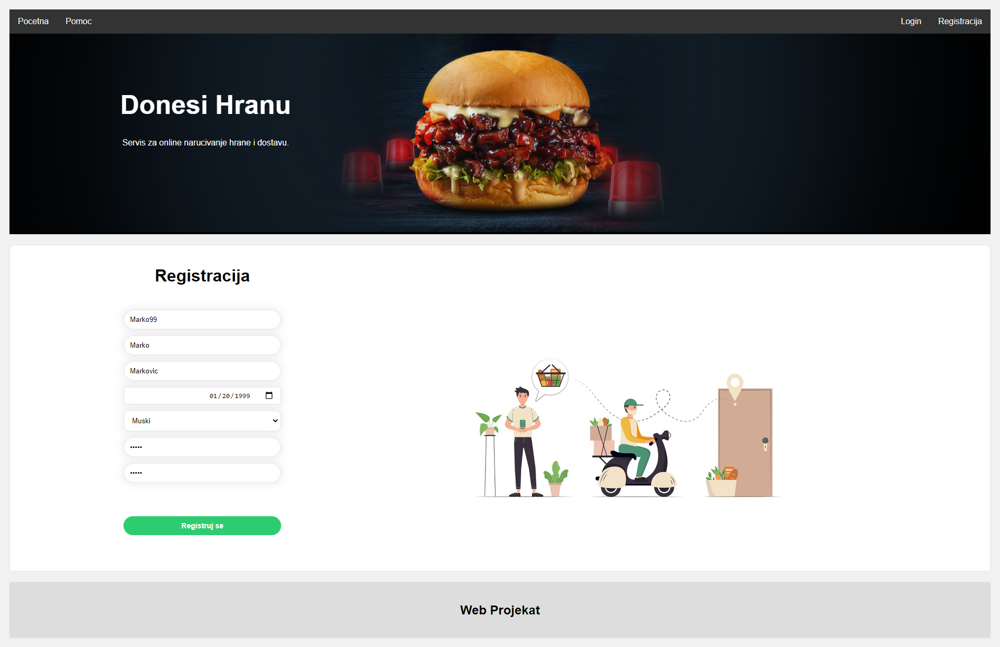

# Donesi

Studentski projekat iz predmeta Web Programiranje, na Fakultetu Tehničkih Nauka u Novom Sadu.

---
##### Rastislav Kukučka RA-129-2018
##### Milica Vučinić RA-139-2018

---
# Demonstracija rada aplikacije

### Poečteni prikaz web sajta
Svi korisnici su u mogućnosti da vide postojeće restorane, da vrše pretrage i filtriranje istih.

---
### Prijava na sistem
Kako bi korisnici mogli da obavljaju aktivnosti u skladu sa svojom ulogom, potrebno je da se prijave na sistem. Postojeće uloge su:
- Kupac
- Menadžer restorana
- Dostavljač 
- Admin

---
### Registracija novih korisnika
Korisnici koji žele da kupuju preko web sajta, moraju se registrovati.
Dostavljače i Menadžere registruje admin lično!

---
### Detaljan prikaz odabranog restorana
Kupac može da filtrira i sortira pića i hranu. 
Takođe može da čita komentare prethodnih kupaca.

---
### Prikaz korpe
Kupac može da kupuje iz različitih restorana, menja sadržaj i količinu artikala.
Za svaki restoran kreira se porudžbenica.
Kupac ostvaruje popust u zavisnosti od ranga koji je ostvario. 
Postojeći rangovi su:
 - BRONZANI
 - SREBRNI
 - ZLATNI 
 

---
### Prikaz profila kupca i istoriju poručivanja
Kupac na ovoj stranici može da prati stanje svih svojih porudžbenica
Omogućena je ptrega, filtriranje i sortiranje porudžbina kako bi kupac lako pronašao željenu porudžbenicu.
Na dnu prikaza vidimo dve nove narudžbenice koje smo prethodno kreirali.

---
### Prikaz svih porudžbenica iz restorana
Menadžer može da prati stanje svih porudžbenica svog restorana.
Omogućena je ptrega, filtriranje i sortiranje porudžbina.

---
### Stanje porudžbenice OBRADA

---
### Stanje porudžbenice U PRIPREMI

---
### Dostavljač šalje zahtev
Kada menadžer označi da je neka porudžbina u statusu ČEKA DOSTAVLJAČA
Tada svi dostavljači mogu da konkurišu na porudžbenicu

---
### Menadžer bira dostavljača
Menadžer može da odbije nepoželjne dostavljače i da prihvati jednog dostavljača.

---
### Prikaz porudžbenica dostavljača
Dostavljač može da prati stanje svih porudžbenica koje su mu dodeljene.
Kada dostavi porudžbenicu, može da promeni status u DOSTAVLJENA

---
### Kupac ocenjuje uslugu
Kada je porudžbenica u statustu DOSTAVLJENA, kupac može da oceni uslugu brojem od 1 do 5, i da napiše komentar.

---
### Menadžer dobija ocenu i komentar
Menadžer vidi ocene i komentare svojih kupaca, može da ih prihvati ili odbije.

---
### Prikaz svih artikala restorana menadžeru
Menadžer ima priliku da vidi sve artikle koje njegov restoran sadrži.
Može da dodaje nove artikle ili da menja postojeće.

---
### Prikaz svih korisnika u sistemu
Admin ima mogućnost pregleda svih korisnika na sistemu.
Ima mogućnost da obriše ili blokira sumnjive korisnike.

---
### Admin kreira novi Restoran
Admin može da kreira novi restoran i na njega doda postojećeg menadžera ili na licu mesta napravi novog.

---
